# 论文阅读笔记:Adversarial Robustness through Bias Variance Decomposition: A New Perspective for Federated Learning  
# 联邦学习新视角:基于偏差方差分解的对抗鲁棒性  

## Abstract  
In this work, we show that this paradigm might inherit the adversarial vulnerability of the centralized neural network, i.e., it has deteriorated performance on adversarial examples when the model is deployed.  
在这项工作中，我们表明这种范式可能继承集中式神经网络的对抗性脆弱性，即当部署模型时，它在对抗性样本上的性能会下降。  
To solve this problem, we propose an adversarially robust federated learning framework, named Fed_BVA, with improved server and client update mechanisms. This is motivated by our observation that the generalization error in federated learning can be naturally decomposed into the bias and variance triggered by multiple clients' predictions. Thus, we propose to generate the adversarial examples via maximizing the bias and variance during server update, and learn the adversarially robust model updates with those examples during client update.  
为了解决这个问题，我们提出了一个对抗鲁棒的联邦学习框架，名为Fed_BVA，它具有改进的服务器和客户端更新机制。这是因为我们观察到，联邦学习中的泛化误差可以自然地分解为由多个客户预测触发的偏差和方差。因此，我们提出在服务器更新期间通过最大化偏差和方差来生成对抗样本，并在客户端更新期间使用这些样本进行对抗训练。  

## 1.Introduction  
Our work studies the adversarial robustness of federated learning paradigm by investigating the generalization error incurred in the server's aggregation process from the perspective of bias-variance decomposition.Specifically, we show that this generalization error on the central server can be decomposed as the combination of bias (triggered by the main prediction of these clients) andvariance (triggered by the variations among clients' predictions).This motivates us to propose a novel adversarially robust federated learning framework Fed_BVA1. The key idea is to perform the local robust training on clients by supplying them with bias-variance perturbed examples generated from a tiny auxiliary training set on the central server.  
我们的工作从偏差-方差分解的角度研究了服务器聚合过程中产生的泛化误差，研究了联邦学习范式的对抗鲁棒性。具体来说，我们表明，中央服务器上的这种泛化误差可以分解为偏差(由这些客户端的主要预测引起)和方差(由客户端预测之间的不同引起)的组合。这促使我们提出了一种新的对抗鲁棒的联邦学习框架Fed_BVA。关键思想是通过向客户端提供由中央服务器上的一个小辅助训练集生成的偏差方差对抗样本进行局部对抗训练。  

+ First, it encourages the clients to consistently produce the optimal prediction for perturbed examples, thereby leading to a better generalization performance.  
+ Second, local adversarial training on the perturbed examples learns a robust local model, and thus an adversarially robust global model could be aggregated from clients' local updates.    

### Major Contributions  
+ We provide the exact solution of bias-variance analysis w.r.t. the generalization error for neural networks in the federated learning setting. As a comparison, performing the adversarial training on conventional federated learning methods can only focus on the bias of the central model but ignore the variance.  
+ We demonstrate that the conventional federated learning framework is vulnerable to strong attacks with increasing communication rounds even if the adversarial training using the locally generated adversarial examples is performed on each client.  
+ Without violating the clients' privacy, we show that providing a tiny amount of bias-variance perturbed data from the central server to the clients through asymmetrical communication could dramatically improve the robustness of the training model under various adversarial settings.  
+ 我们提供了神经网络在联邦学习环境下泛化误差的方差偏差分析的精确解。相比之下，在传统的联邦学习方法上进行对抗性训练，只能关注中心模型的偏差，而忽略了方差。 
+ 我们证明，即使在每个客户端上使用本地生成的对抗性示例进行对抗性训练，随着通信次数的增加，传统的联邦学习框架也容易受到对抗攻击。  
+ 在不侵犯客户隐私的情况下，我们表明通过不对称通信从中央服务器向客户端提供少量偏差方差扰动数据可以显着提高训练模型在各种对抗设置下的鲁棒性。  

## 2.Related Work  
### 2.2 Bias-Variance Decomposition   
Bias-Variance分解最初是为了分析学习算法的泛化误差而引入的。然后，在允许灵活损失函数的分类任务设置下，人们研究了广义Bias-Variance分解。具体而言，在一般条件下，学习算法的泛化误差可以分解为偏差，方差和噪声。其中，Bias度量了不同训练数据集上的训练模型偏差最优模型的程度，Variance度量了这些训练模型之间的差异。此外，先前观察到，随着模型复杂度的增加，bias单调减少，variance单调增加。这表明更好地权衡Bias和Variance可以提高学习算法的泛化性能。然而，近年来的经验表明，增加深度神经网络的模型复杂性往往会产生更好的泛化性能，这与以往的偏差方差分析是矛盾的。根据这一想法，偏差-方差权衡在现代神经网络模型上进行了实验研究。研究发现，随着模型复杂度的增加，Variance更有可能是先增大再减小。
我们想指出的是，与标准的监督学习相比，联邦学习可以更好的通过bias-variance来表征。这是因为在本地客户中训练的模型，可以自然地应用于定义学习算法泛化误差中的偏差和误差。  

### 3.Preliminaries  
In this section, we formally present the problem definition and the bias-variance trade-off in the classification setting.  
### 3.1 Federated learning   
在联邦学习中，有一个中央服务器和K个客户端，每个客户端都有数据集$D_k = \{(x^k_i,t^k_i)  \} ^{n_k}_{i=1}$. $x^k_i,t^k_i,n_k$分别代表特征，标签，数量。每个数据集$D_k$只被第k个客户端所有，不会被分享到中央服务器和其他客户端上。   
联邦学习的一般步骤:  
+ Client Update: Each client updates local parameters $𝑤_𝑘$ by minimizing the empirical loss over its own training set;  
+ Forward Communication:Each client uploads its parameter update to the central server;  
+ Server Update: It synchronously aggregates the received parameters;  
+ Backward Communication: The global parameters are sent back to the clients.  

### 3.2 Problem Definition and Motivation  
Adversarially robust federated learning aims to output a trained model on the central server that is robust against adversarial perturbations on the test set $D_{𝑡𝑒𝑠𝑡}$ .  

The generalization error of the server's model is induced by both bias and variance of local clients' models.we propose to analyze the adversarially robust federated learning in a unified framework.  
服务器模型的泛化误差是由本地客户端模型的偏差和方差共同引起的,我们建议在一个统一的框架中分析对抗鲁棒联邦学习。  

The crucial idea is to generate some global adversarial examples shared with clients by leveraging a tiny auxiliary training set $D_s$ with $n_s$ examples on the server.  
关键思想是通过利用一个小的辅助训练集，生成一些与客户共享的全局对抗性示例

The problem definition has the following properties:  
+ Asymmetrical communication: The asymmetrical communication between each client and server cloud is allowed: the server provides both global model parameters and limited shared data to the clients; while each client uploads its local model parameters back to the server.  
+ 不对称通信：允许每个客户端和服务器云之间的不对称通信：服务器向客户端提供全局模型参数和有限的共享数据；而每个客户端将其本地模型参数上传回服务器。  
+ Data distribution: All training examples on the clients and the server are assumed to follow the same data distribution. However, the experiments show that our proposed algorithm also achieves outstanding performance under the non-IID setting (see Subsection 6.2), which could be commonly seen among personalized clients in real scenarios.  
+ 数据分布：假设客户端和服务器上的所有训练实例都遵循相同的数据分布。然而，实验表明，我们提出的算法在非IID环境下也取得了优异的性能(见第6.2节)，这在真实场景中的个性化客户中是常见的。  
+ Shared learning algorithm: All the clients are assumed to use the identical model 𝑓 (·), including architectures as well as hyper-parameters.  
+ 共享学习算法：假设所有客户端使用相同的模型f(·)，包括模型结构和超参数。  

### 3.3 Bias-Variance Trade-off  
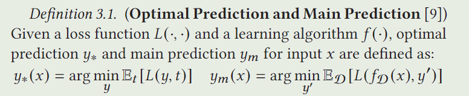  
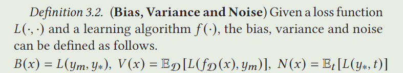  
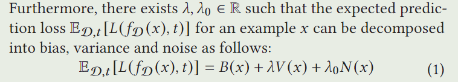   

## 4.The Proposed Framework  
In this section, we present the adversarially robust federated learning framework. It follows the same paradigm of traditional federated learning (see Subsection 3.1) but with substantial modifications on the server update and client update as follows.  

### 4.1 Server Update with Data Poisoning  
This Server has tow crucial components:  
+ Model Aggregation: It synchronously compresses and aggregates the received local model parameters.  
+ Adversarial Examples Producing: This component is designed to produce adversarially perturbed examples which are induced by a poisoning attack algorithm for the usage of adversarial training.  

#### 4.1.1 Model Aggregation   
Our framework is flexible to be incorporated with existing model aggregation methods, FedAvg, FedMA, AFL, etc.  

#### 4.1.2 Adversarial Examples   
如果我们直接在每个客户端上进行对抗训练，会造成以下两个问题:  
+ First, it will significantly increase the computational burden and memory usage on local clients.  
+ Second, the locally generated adversarial examples make the augmented data distributions of local clients much more biased, which challenges the standard server-level aggregation mechanisms.  

定理4.1  
在二元情况下，Eq.(1)中的分解适用于任何满足的$\forall_y L(y,y)=0且\forall_{y_1 \ne y_2}L(y_1,y_2) \ne 0$实值损失函数，且$\lambda$满足:  
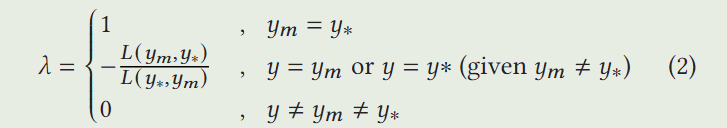  

when bias exists $𝑦_𝑚\ne 𝑦_∗$, a negative variance will help to reduce error when the prediction is identical to the main prediction or optimal prediction  
  
但是本文中的$\lambda$被视为超参数。 

如何生成对抗样本，参考等式(1)，提出最优化下式来生成对抗样本:  
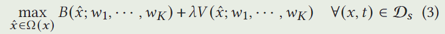   

### 4.2 Robust Clinet Update  
The robust training of one client's prediction model ($𝑤_𝑘 $) can be formulated as the following minimization problem:  
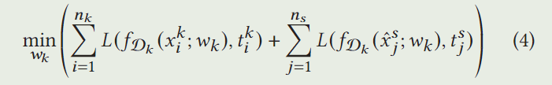  

Bias measures the systematic loss of a learning algorithm, and the variance measures the prediction consistency of the learner over different training sets.  
偏差衡量学习算法的系统损失，方差衡量学习者在不同训练集上的预测一致性。  

our robust federated learning framework has the following advantages:  
+ it encourages the clients to consistently produce the optimal prediction for perturbed examples, thereby leading to a better generalization performance;  
+ local adversarial training on perturbed examples allows to learn a robust local model, and thus a robust global model could be aggregated from clients.  

## 5.Instantiated Algorithm  
### 5.1 Bias-Variance Attack  
#### Bias-variance based Fast Gradient Sign Method (BV-FGSM)  
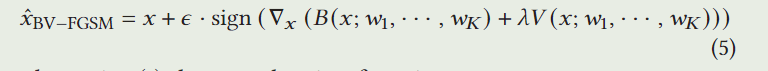  
#### Bias-variance based Projected Gradient Descent (BV-PGD)  
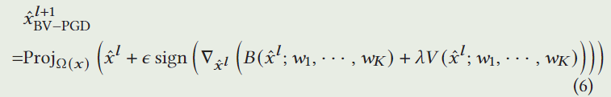  

The proposed framework could b generalized to any gradientbased adversarial attack algorithms where the gradients of bias 𝐵(·)and variance 𝑉 (·) w.r.t. 𝑥 are tractable when estimated from finite training sets. Compared with the existing attack methods, our loss function the adversary aims to optimize is a linear combination of bias and variance, whereas existing work mainly focused on attacking the overall classification error involving bias only.  

下列定理表明，bias和variance，以及它们在input x上的梯度，都可以通过client model来进行估计。  
定理5.1:  
假设L是交叉熵损失函数，经验估计的对一个输入样本$(x,t)$的main prediction $y_m$, $y_m(x) = \frac{1}{K}\sum_{k=1}^K f_{D_k}(x;w_k)$,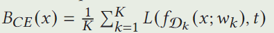,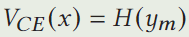。他们对应梯度为:  
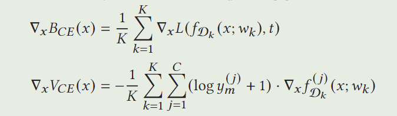  

### 5.2 Fed_BVA  
