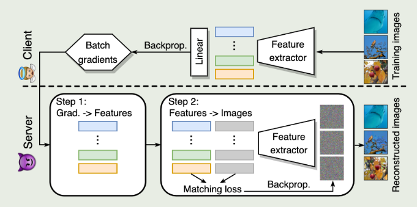

# Privacy Leakage of Adversarial Training Models in Federated Learning Systems  
# 联邦学习系统中对抗训练模型的隐私泄露风险   

## 1.Introduction  
It can make models more likely to leak the data privacy than the ones that undergoes vanilla training (i.e., using the original clean images instead of online-generated adversarial examples).  
经过对抗训练的模型比起普通训练的模型来说，更有可能会泄露用户隐私数据。  
本文模型目的: 
The goal is to compromise the privacy of FL clients by reconstructing their own training images (which may contain private information) based on the weight gradients that are communicated between the clients and the central server.  
本文模型步骤:  
our attack methodology forms a unique two-step procedure, where we first restore the features (i.e., the outputs of the penultimate layer) from the gradients, and then reconstruct the inputs using the recovered features as supervision (see Fig. 1 for illustration).  
