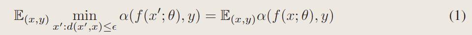
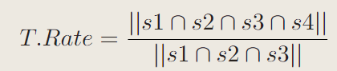
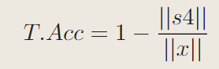

#! https://zhuanlan.zhihu.com/p/630547147
# Understanding Adversarial Transferability In Federated Learning  
# 理解联邦学习中的对抗迁移性   
## Abstract   
In this paper, we investigate the robustness and security issues from a different, simpler, but practical setting: a group of malicious clients has impacted the model during training by disguising their identities and acting as benign clients, and only revealing their adversary position after the training to conduct transferable adversarial attacks with their data, which is usually a subset of the data that FL system is trained with.  
在本文中，我们从一个不同的，更简单的，但实际的设定中研究了联邦学习的鲁棒性和安全性问题：一组恶意客户端通过伪装其身份，扮演良性客户，只在训练结束后暴露自己的恶意定位，用他们的数据进行可迁移的对抗性攻击，这些数据通常是FL系统训练时候使用的数据的子集。  
Our aim is to offer a full understanding of the challenges the FL system faces in this setting across a spectrum of configurations. We notice that such an attack is possible, but the federated model is more robust compared with its centralized counterpart when the accuracy on clean images is comparable.Through our study, we hypothesized the robustness is from two factors: the decentralized training on distributed data and the averaging operation.  
我们的目标是全面了解FL系统在这种情况下所面临的各种挑战。我们注意到，这样的攻击是可能的，但当对干净图像的准确性与之相当时，联合模型比集中式模型更健壮。通过我们的研究，我们假设稳健性来自两个因素：分布式数据的分散训练和平均操作。  

## 1.Introduction   
in most real-world scenarios where FL system is trained and deployed, adversary have no access to any knowledge of the model or the full training set.  
在训练和部署FL系统的大多数现实场景中，攻击者无法访问模型或完整训练集的任何知识。  

We notice that FL is naturally raising another security and robustness challenge: during the training, the malicious client can disguise to be a benign one to contribute regularly to the update of the model parameters, and only reveal its adversary identity after the training. Thus, the client naturally obtains a subset of the data used to train the FL model, and has the potential to exploit this slice of data for adversarial attacks. The attacker, after acquiring the data, can train a substitute model to perform the transfer-based black-box attack.
我们注意到FL自然地提出了另一个安全性和鲁棒性挑战:在训练期间，恶意客户端可以伪装成一个良性客户端，定期为模型参数的更新做出贡献，并且只有在训练后才显示其对手身份。因此，客户端自然获得用于训练FL模型的数据子集，并有可能利用这部分数据进行对抗性攻击。攻击者在获取数据后，可以训练一个替代模型来执行基于传输的黑盒攻击。  

Stemming from the above discussed scenarios, we propose a simple yet practical assumption: the attacker possesses some but limited amount of the users' data but no knowledge about the target model or the full training set.First, we establish baseline models with ResNet50 on CIFAR10 to provide preliminary understandings about the robustness of FL under white-box attack. Then we evaluate the transferability of adversarial examples generated from different source models to attack a federated-trained model. We further investigate two properties of FL, namely the decentralized training and the averaging operation, and their correlation with federated robustness.   
根据上述讨论的场景，我们提出了一个简单而实用的假设:攻击者拥有一些但数量有限的用户数据，但不知道目标模型或完整的训练集。首先，我们在CIFAR10上使用ResNet50建立baseline，初步了解FL在白盒攻击下的鲁棒性。然后，我们评估了从不同源模型生成的对抗样本的可转移性，以攻击联邦训练的模型。我们进一步研究了FL的两个性质，即分散训练和平均操作，以及它们与联邦鲁棒性的关系。  

Findings:  
+ We find that, while there is indeed security challenges of this setting (i.e. the malicious clients can attack the federated model after the training through transferable adversarial examples), the federated model is more robust under white-box attack compared with its centralized-trained counterpart when their accuracy on clean images are comparable.  
+ We investigate the transferability of adversarial examples generated from models trained by various number of users' data. We observe that, without any elaborated techniques such as dataset synthesis Papernot et al. (2017) or attention Wu et al. (2020), a regularly trained source model with only limited users' data can perform transfer attack. With ResNet50 on CIFAR10 datatset, we achieve an transfer rate of over 60% with only 10% of the total clients and an transfer rate of almost 90% with 20%. With strong augmentation, source model can attack with a transfer rate of almost 70% and 80% using only 5% and 7% of the total users.  
+ We investigate two intrinsic properties of the FL, namely the property of distributed training and the averaging operation and discover that both heterogeneity and dispersion degree of the decentralized data as well as the averaging operations can significantly decreases the transfer rate of transfer-based black-box attack.  

## 2.Background  
给定模型f，f被称为鲁棒模型，只要f满足:  
  
### Discussion  
In this paper, we adopt the idea of transfer-based attack into the practical setting of FL by proposing a simple yet realistic attack setting. Here, we discuss the key differences and the significance of our setting compared with others.  
Key Difference 1: Different from query-based or transfer-based black-box attack, we assume the malicious clients possess the data themselves, impacting the target model during training and attack during inference. We also present a comparison of our attack setting and the query-based attack in Appendix A. Note that our attack setting doesn't contradict with the query-based attack. In fact, we can perform with both if the FL system allows a certain number of queries, which we leave to future works to explore.  
Key Difference 2: Poisoning attack or backdoor attack manipulates the parameters update during target model training which can be defended by anomaly detection. Moreover, in practical, despite clients preserve the training data locally, the training procedure and communication with the server are highly encapsulated and encrypted with secret keys, which is even more unrealistic and laborsome to manipulate. Our attack setting circumvents this risk since no hostile action is performed during the training but successfully boost the attack possibility during inference time.   

## 3.Investigation Setup And Research Goals  
It is of necessity to investigate the robustness of federated model against transfer-based attack, transferability of adversarial examples against FL.More importantly, we want to understand where do the robustness of FL comes from and how the core components of FL effects its own robustness. To sum up, we put forward the following research goals:  
我们认为很有必要研究联邦模型对基于迁移的攻击的鲁棒性，对抗性样本对联邦学习的可转移性，更重要的是，我们想了解联邦学习的鲁棒性来自哪里，以及联邦学习的核心组件如何影响其自身的鲁棒性。综上所述，我们提出了以下研究目标:  
GOAL 1: Investigate the possibility of a transfer attack with limited data and validate whether it is possible and practical for the attacker to lay benign during the training process and leverage the obtained data and performs the adversarial attack.   
目标1：在有限的数据下，研究迁移攻击的可行性，验证恶意客户端在训练过程中能否在训练过程中伪装成良性客户端，并且利用可以获得的数据进行对抗攻击。

GOAL 2: Explore the adversarial examples generated by various models (trained in different paradigms) and their tranferability against the federated model.   
目标2：探索由各种模型生成的对抗样本，以及他们对于联邦学习训练出的模型的可迁移性。

GOAL 3: We aim to explore how different degree of decentralization and the heterogeneity of data affects the transfer attack. We also aim to investigate how the aggregation influences the transferability of the adversarial examples against the FL model.  
目标3:我们的目标是探索不同程度的去中心化和数据的异质性如何影响迁移攻击。我们还旨在研究聚合算法如何影响对抗样本的可迁移性。  

### 3.1 Experiment Setup  
#### Threat Model:  
We use PGD and  perform the PGD with 10 iterations, no random restart, and an epsilon of 8 / 255 over $L_{\infty}$ norm on CIFAR10.  
#### Settings:  
We first build up the basic FL setting. We split the datatset into 100 partitions of equal size in an iid fashion. We adopt two models for the experiments: CNN and the widely used ResNet50 which represents a more realistic evaluation.  
We concudt training in three paradigms:   
+ The centralized model:  
  + we leverage SDG with momentum of 0.9, weight decay of 1e-3, learning rate of 0.01 and batch size of 64.
+ Federated model:  
  + We use SGD without momentum, weight decay of 1e-3, learning rate of 0.1, local batch size of 50 following.  
  + We train locally 5 epochs on ResNet50 and 1 epoch on CNN.
+ The source model with limited number of client' data:
  + we leverage SDG with momentum of 0.9, weight decay of 1e-3, learning rate of 0.01 and batch size of 64.  

### 3.2Adversarial Transferability In Federated Learning  
Source model is the substitute model used to generate adversarial examples while target model is the target aimed to attack.  
Source model 是用来生成对抗样本的替代模型，targetmodel是我们要攻击的目标。   
Adversarial transferability against the target model refers to the ability of an adversarial examples generated from the source model to attack the target model (becomes an adversarial example of target model).  
针对Target Model的可迁移性指代从source model生成的对抗样本对target model展开攻击的能力(称为target model的对抗样本)。本文定义迁移率来评估对抗迁移率:  
  
定义$T.Acc$如下所示:  
  

### 3.3Robustness With Comparable Accuracy  
However, we conjecture that such increase in adversarial accuracy is not attributed to intrinsic robustness of centralized model but largely due to its high clean accuracy.We can see, when both models reach a comparable clean accuracy, federated model shows greater robustness against white-box attack compared with the centralized model.  

## 4.Experiments  
In this section, we first discuss the transfer attack in Section 4.1 and then explore the possibility of attacking with limited data in Section 4.2.  
在本节中，我们首先在4.1节中讨论迁移攻击，然后在4.2节中探讨使用有限数据进行攻击的可能性。  
### 4.1Robustness Against Transfer Attack  
We explore the examples generated by two different training paradigms and their transferability when applying them to different models.  

we can see that the adversarial examples generated by federated model are highly transferable to both federated and centralized model while adversarial examples generated by centralized model exhibit less transferability. The T.Rate of federated-to-centralized attack is even larger than centralized-to-centralized attack.  
我们可以看到，联邦模型生成的对抗样本对联邦模型和集中式模型都具有高度的可迁移性，而集中式模型生成的对抗样本的可转移性较差。联邦式到集中式的迁移攻击率甚至大于集中式到集中式的迁移攻击率。

Secondly, T.Rate of adversarial examples between models trained under same paradigms is larger than models trained under different paradigms, which can be attributed to the difference of the two training paradigms, e.g. the discrepancy in the decision boundary.   

### 4.2Transfer Attack With Limited Data  
In this section, we will evaluate the possibility of our proposed attack setting, i.e. transfer attack with limited data.To simulate this scenario, we fixed the generated partition used in the federated training and randomly selects a specified number of users as malicious clients whose data is available for performing the attack.  
在本节中，我们将评估我们提出的攻击设置的可能性，即使用有限数据的传输攻击。为了模拟此场景，我们固定了在联邦训练中使用的生成分区，并随机选择指定数量的用户作为恶意客户端，其数据可用于执行攻击。  

## 结论   
+ The heterogeneous data and large degree of decentralization both result in lower transferability of adversarial examples from the substitute model.  The attacker can benefit from closing the discrepancy of substitute model and target model (e.g. train substitute model also in federated manner) in terms of transferring.  
+ With more clients to average at each round, the federated model becomes increasingly robust to black-box attack. Defenders can benefit from increasing the number of clients selected at each round to average.

联邦学习为利用来自用户端的大量数据提供了最有前途的解决方案之一。关于其健壮性和安全性问题的各种主题已经被提出和讨论。在本文中，我们确定了一个不同的，更简单的，但实用的设置:一组恶意客户端作为良性客户端参加了训练，并且在训练后才显示他们的对手位置，以使用他们的数据进行可转移的对抗性攻击。我们评估了这种攻击设置的可能性，并发现在有限的数据下，我们可以实现与使用完整训练数据集的转移攻击相似的传输速率。我们还探讨了两个内在属性与FL的迁移鲁棒性之间的关系，并发现分散训练、异构数据和平均操作有助于迁移鲁棒性，并显著降低对抗示例的可转移性。