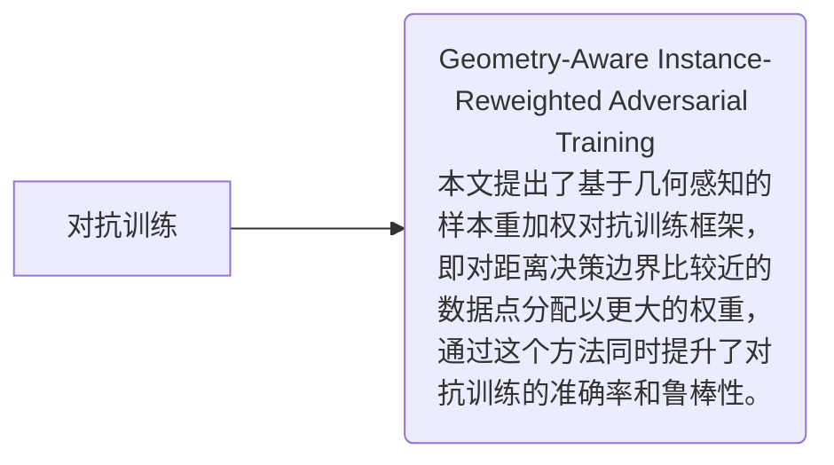
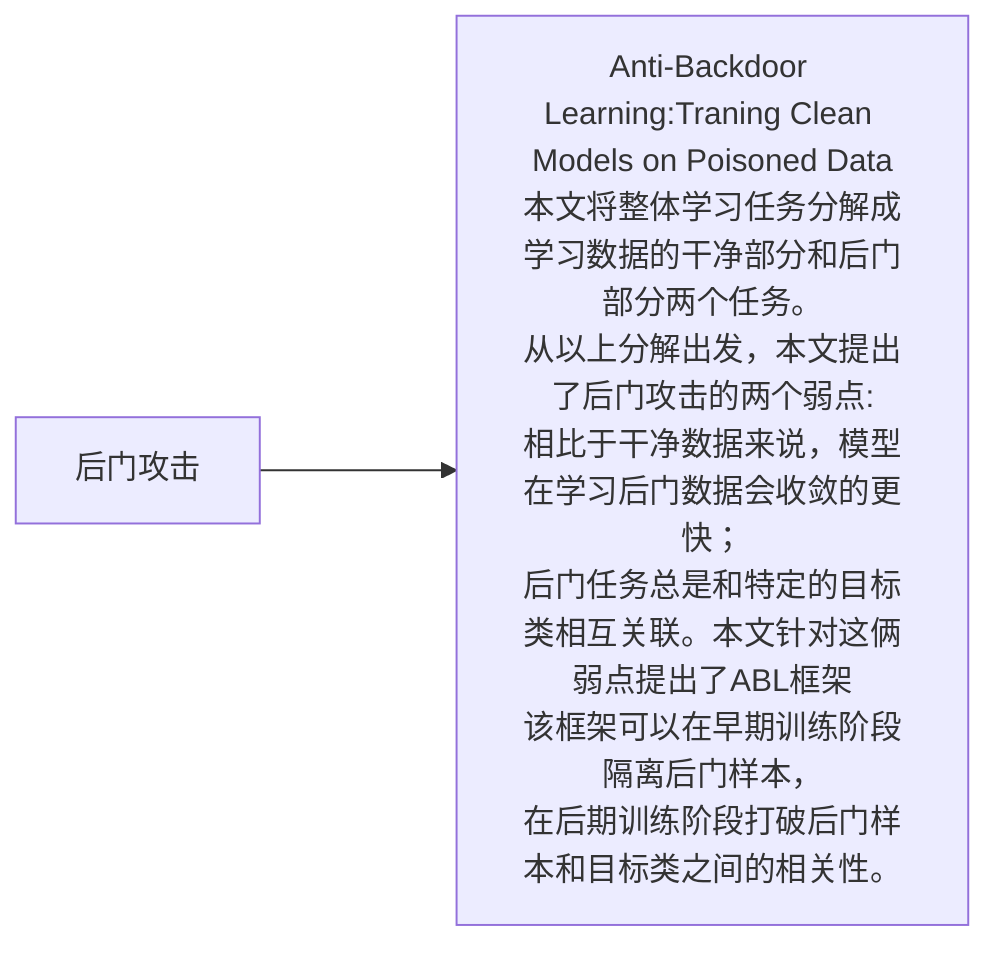
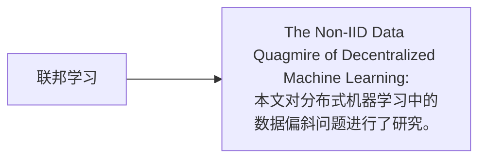

```mermaid
graph LR
a[对抗训练]
a ---> b1("Geometry-Aware Instance-Reweighted Adversarial Training<br>本文提出了基于几何感知的样本重加权对抗训练框架，<br>即对距离决策边界比较近的数据点分配以更大的权重，<br>通过这个方法同时提升了对抗训练的准确率和鲁棒性。")  

```

```mermaid
graph LR
a[后门攻击]
a ---> b1["Anti-Backdoor Learning:Traning Clean Models on Poisoned Data<br>本文将整体学习任务分解成学习数据的干净部分和后门部分两个任务。<br>从以上分解出发，本文提出了后门攻击的两个弱点:<br>相比于干净数据来说，模型在学习后门数据会收敛的更快；<br>后门任务总是和特定的目标类相互关联。本文针对这俩弱点提出了ABL框架<br>该框架可以在早期训练阶段隔离后门样本，<br>在后期训练阶段打破后门样本和目标类之间的相关性。"]

```

```mermaid
graph LR
a[联邦学习] ---> b1["The Non-IID Data Quagmire of Decentralized Machine Learning:<br>本文对分布式机器学习中的数据偏斜问题进行了研究。"]

```