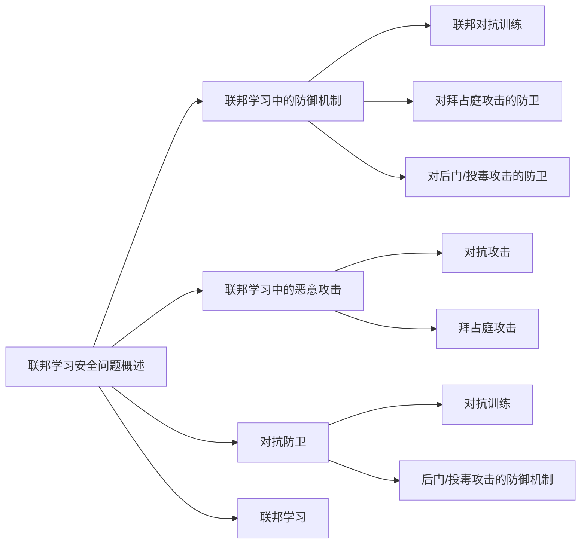

# A-Review-Of-Security-Issues-In-Federated-Learning
This is our first paper, which is called A Review Of Security Issues In Federated Learning.  

```mermaid
graph LR
    O[联邦学习安全问题概述]
    O --> A
    O --> E
    O --> H
    O --> K
    A[联邦学习中的防御机制] --> B[联邦对抗训练]
    A --> C[对拜占庭攻击的防卫]  
    A --> D[对后门/投毒攻击的防卫]
    E[联邦学习中的恶意攻击] --> F[对抗攻击]  
    E --> G[拜占庭攻击]

    H[对抗防卫] --> I[对抗训练]
    H --> J[后门/投毒攻击的防御机制]

    K[联邦学习]
```