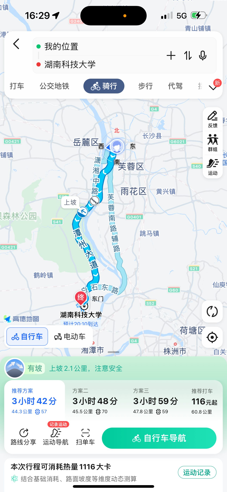

  
我部第一阶段预计进发湖南科大，前半段路程沿湘江行进，后半段路程深入大王山森林公园，周六早上（11月25日）集结于NUDT北门，预计于12.30分前后抵达湖科大，休息吃饭。  

回程走白石东路-天心大道到昭山风景区，然后骑行到德思勤广场用餐，再从德思勤骑行到NUDT三号院南门，送目标回村。  

携行具：背包。  
携带物品：手机，充电宝，数据线，帽子（可选），身份证，学员证，手套，围巾，备用衣物。