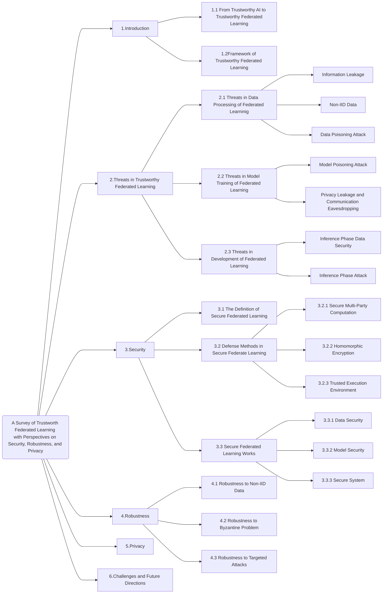

```mermaid  
graph LR 
a(A Survey of Trustworth Federated Learning <br>with Perspectives on Security, Robustness, and Privacy)  
a ---> b1[1.Introduction] ---> b1a[1.1 From Trustworthy AI to <br> Trustworthy Federated Learning]  
b1 ---> b1b[1.2Framework of Trustworthy Federated Learning]
a ---> b2[2.Threats in Trustworthy Federated Learning] ---> b2a[2.1 Threats in Data Processing of Federated Learninig]  
b2a --->b2a1[Information Leakage]
b2a ---> b2a2[Non-IID Data]
b2a ---> b2a3[Data Poisoning Attack]
b2 ---> b2b[2.2 Threats in Model Training of Federated Learning]  
b2b ---> b2b1[Model Poisoning Attack]
b2b ---> b2b2[Privacy Leakage and Communication Eavesdropping]
b2 ---> b2c[2.3 Threats in Development of Federated Learning]  
b2c ---> b2c1[Inference Phase Data Security]
b2c ---> b2c2[Inference Phase Attack]

a --->b3[3.Security]
a --->b4[4.Robustness]
a --->b5[5.Privacy]
a --->b6[6.Challenges and Future Directions]

b3 ---> b3a[3.1 The Definition of Secure Federated Learning]
b3 ---> b3b[3.2 Defense Methods in Secure Federate Learning]
b3 ---> b3c[3.3 Secure Federated Learning Works]
b3b---> b3b1[3.2.1 Secure Multi-Party Computation]
b3b---> b3b2[3.2.2 Homomorphic Encryption]
b3b---> b3b3[3.2.3 Trusted Execution Environment]

b3c ---> b3c1[3.3.1 Data Security]
b3c ---> b3c2[3.3.2 Model Security]
b3c ---> b3c3[3.3.3 Secure System]  

b4 ---> b4a[4.1 Robustness to Non-IID Data]
b4 ---> b4b[4.2 Robustness to Byzantine Problem]
b4 ---> b4c[4.3 Robustness to Targeted Attacks]

```