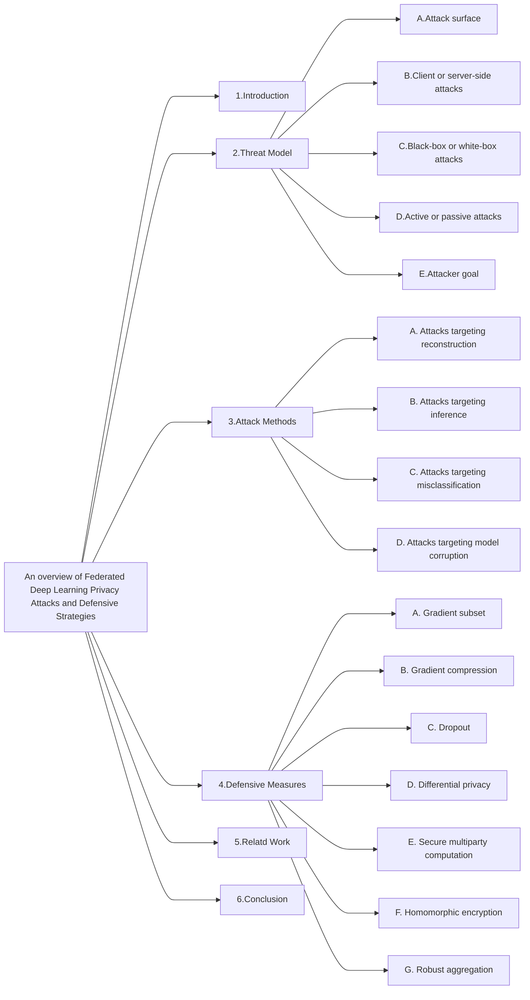

# An overview of Federated Deep Learning Privacy Attacks and Defensive Strategies  

```mermaid
graph LR

a3[An overview of Federated Deep Learning Privacy Attacks and Defensive Strategies]

a3 ---> b1[1.Introduction]  
a3 ---> b2[2.Threat Model]  
b2 ---> b2a[A.Attack surface]
b2 ---> b2b[B.Client or server-side attacks]
b2 ---> b2c[C.Black-box or white-box attacks]
b2 ---> b2d[D.Active or passive attacks]
b2 ---> b2e[E.Attacker goal]
a3 ---> b3[3.Attack Methods]
b3 ---> b3a[A. Attacks targeting reconstruction]
b3 ---> b3b[B. Attacks targeting inference]
b3 ---> b3c[C. Attacks targeting misclassification]
b3 ---> b3d[D. Attacks targeting model corruption]


a3 ---> b4[4.Defensive Measures]   
b4 ---> b4a[A. Gradient subset]
b4 ---> b4b[B. Gradient compression]
b4 ---> b4c[C. Dropout]
b4 ---> b4d[D. Differential privacy]
b4 ---> b4e[E. Secure multiparty computation]
b4 ---> b4f[F. Homomorphic encryption]
b4 ---> b4g[G. Robust aggregation] 


a3 ---> b5[5.Relatd Work]
a3 ---> b6[6.Conclusion]

```