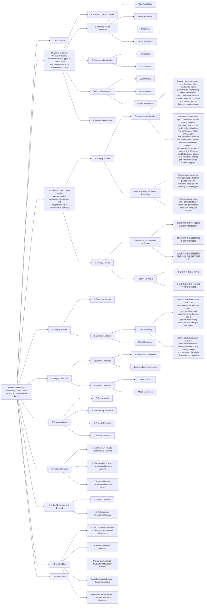

# Robust and Privacy-Preserving Collaborative Learning: A Comprehensive Survey  

```mermaid
graph LR
a2[Robust and Privacy-Preserving Collaborative Learning: A comprehensive Survey]  
a2 ---> a2b1[1.Introduction]  
a2 ---> a2b2[2.Stystem Overview:<br>We systematically introduce different types of collaborative <br>learning systems from various perspectives.]
a2 ---> a2b3[3.Threat In Collaborative Learning:<br> We summarize summarizes the privacy and <br> integrity threats in collaborative learning]
a2 ---> a2b4[4.Integrity Attacks]
a2 ---> a2b5[5.Integrity Defenses]
a2 ---> a2b6[6.Privacy Attacks]
a2 ---> a2b7[7.Privacy Defenses]
a2 ---> a2b8[8.Hybrid Defenses And Beyond]
a2 ---> a2b9[9.Open Problem]
a2 ---> a2b10[10.Conclusion]
a2b2 ---> a2b2a[A.Machine Learning Model]
a2b2 ---> a2b2b[B.Deimensions of Parallelism]
a2b2 ---> a2b2c[C.Parameter Distribution]
a2b2 ---> a2b2d[D.Model Consistency]
a2b2 ---> a2b2e[E.Federated Learning]
a2b2b ---> a2b2b1[Data Parallelism]
a2b2b ---> a2b2b2[Model Parallelism]
a2b2b ---> a2b2b3[Pipelining]
a2b2b ---> a2b2b4[Hybrid Parallelism]
a2b2c ---> a2b2c1[Centralized]  
a2b2c ---> a2b2c2[Decentralized]  
a2b2d ---> a2b2d1[Synchronous]
a2b2d ---> a2b2d2[Asynchronous]
a2b2d ---> a2b2d3[Stale-Synchronous]

a2b3 ---> a2b3a[A.Integrity Threats]
a2b3 ---> a2b3b[B.Privacy Threats]
a2b3a ---> a2b3a1[Compromise vs Backdorr]
a2b3a1 ---> a2b3a1a[Compromise attacks aims to reduce or destory <br> the trained model performance by changing model parameters, <br>which normally makes the shared model not converge <br> to a satisfactory one during the training phase.]
a2b3a1 ---> a2b3a1b[Backdoor attacks try to inject predefined malicious training samples, <br> backdoors, into a victim model while maintaining the performance of the primary task. <br> The backdoors would be activated if a input sample contains the injected triggers. <br> Because of the secrecy of triggers, it is difficult to identify backdoor attacks <br> as a backdoored model performs normally on normal samples.]

a2b3a ---> a2b3a2[Data Poisoning vs. Model Poisoning]
a2b3a2 ---> a2n3a2a[Attackers can poison the training datasets of some participants with <br>malicious samples with carefully crafted triggers]
a2b3a2 ---> a2n3a2b[Attackers compromise some participants and completely control their <br> behaviour during the training]

a2b3b ---> a2b3b1[Membership vs. Property vs. Sample]
a2b3b ---> a2b3b2[Passive vs. Active]
a2b3b1 ---> a2b3b1a[成员推理攻击确定记录是否在模型的训练数据集中]
a2b3b1 ---> a2b3b1b[属性推理攻击旨在推断参与者训练数据的属性]
a2b3b1 ---> a2b3b1c[攻击者在训练阶段获得模型更新时提取训练数据及其标签]

a2b3b2 ---> a2b3b2a[被动模式-不改变任何内容]
a2b3b2 ---> a2b3b2b[主动模式-攻击者可以在训练过程中做任何事情]


a2b4 ---> a2b4a[A.Byzantine Attacks]
a2b4 ---> a2b4b[B.Backdoor Attacks]
a2b4b ---> a2b4b1[Data Poisoning]
a2b4b ---> a2b4b2[Model Poisoning]  
a2b4b1 ---> a2b4b1a[Unclean label stand-alone backdoord<br>the adversary introduces a number of <br> miss-classified data samples into the training set. It<br> poisons the training examples and changes their labels.]
a2b4b1 ---> a2b4b1b[Clean label stand-alone backdoor<br>the adversary cannot change the label of any training sample<br> and preserves the labels of the poisoned samples<br>]  

a2b5 ---> a2b5a[Byzantine Defences]  
a2b5 ---> a2b5b[Backdoor Defences]  

a2b5a ---> a2b5a1[Statistic-based Inspection]  
a2b5a ---> a2b5a2[Learning-based Inspection]  

a2b5b ---> a2b5b1[Data Inspection]  
a2b5b ---> a2b5b2[Model Inspection]  
a2b6 ---> a2b6a[A.Threat Model]
a2b6 ---> a2b6b[B.Membership Inference]
a2b6 ---> a2b6c[C.Property Inference]
a2b6 ---> a2b6d[D.Sample Inference]

a2b7 ---> a2b7a[A. Differentially Private Collaborative Learning]
a2b7 ---> a2b7b[B. Cryptographic Privacy-preserving Collaborative Learning]
a2b7 ---> a2b7c[C. Practical Privacy-preserving Collaborative Learning]

a2b8 ---> a2b8a[A. Hybrid Defenses]
a2b8 ---> a2b8b[B. Collaborative Adversarial Training]

a2b9 ---> a2b9a[Non-IID or Noisy Scenarios in Byzantine Attacks and Defenses]
a2b9 ---> a2b9b[Certified Backdoor Defenses]
a2b9 ---> a2b9c[Privacy-performance Tradeoff in Differential Privacy]
a2b9 ---> a2b9d[Basis Datasets in Property Inference Attacks]
a2b9 ---> a2b9e[Performance Improvement in Sample Inference Defenses]

```