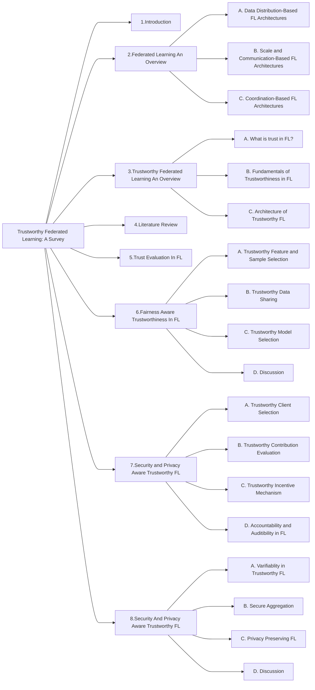

# Trustworthy Federated Learning: A Survey

```mermaid  
graph LR 

a[Trustworthy Federated Learning: A Survey] ---> b1[1.Introduction]  
a ---> b2[2.Federated Learning An Overview]   
b2 ---> b2a[A. Data Distribution-Based FL Architectures]
b2 ---> b2b[B. Scale and Communication-Based FL Architectures]
b2 ---> b2c[C. Coordination-Based FL Architectures]
a ---> b3[3.Trustworthy Federated Learning An Overview]
b3 ---> b3a[A. What is trust in FL?]
b3 ---> b3b[B. Fundamentals of Trustworthiness in FL]
b3 ---> b3c[C. Architecture of Trustworthy FL]
a ---> b4[4.Literature Review]
a ---> b5[5.Trust Evaluation In FL]
a ---> b6[6.Fairness Aware Trustworthiness In FL]
b6 ---> b6a[A. Trustworthy Feature and Sample Selection]
b6 ---> b6b[B. Trustworthy Data Sharing]
b6 ---> b6c[C. Trustworthy Model Selection]
b6 ---> b6d[D. Discussion]

a ---> b7[7.Security and Privacy Aware Trustworthy FL]  
b7 ---> b7a[A. Trustworthy Client Selection]
b7 ---> b7b[B. Trustworthy Contribution Evaluation]
b7 ---> b7c[C. Trustworthy Incentive Mechanism]
b7 ---> b7d[D. Accountability and Auditibility in FL]
a ---> b8[8.Security And Privacy Aware Trustworthy FL]
b8 ---> b8a[A. Varifiablity in Trustworthy FL]
b8 ---> b8b[B. Secure Aggregation]
b8 ---> b8c[C. Privacy Preserving FL]
b8 ---> b8d[D. Discussion]

```